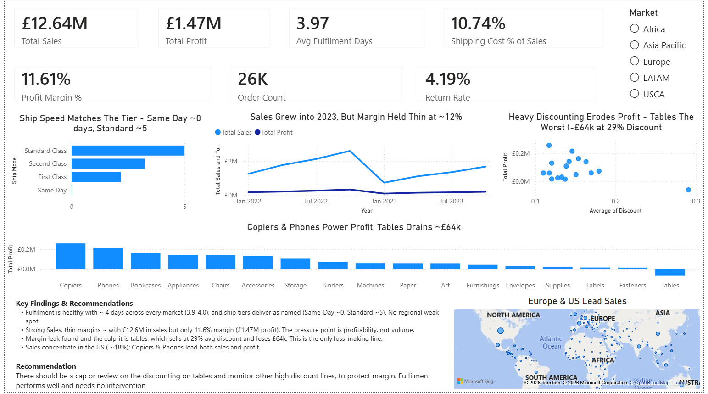
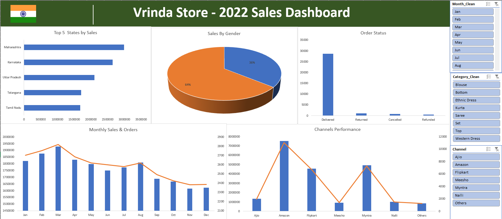
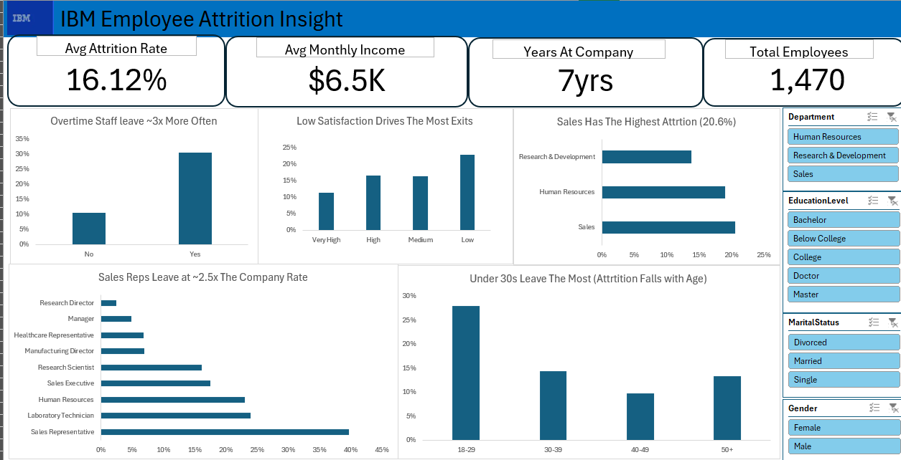
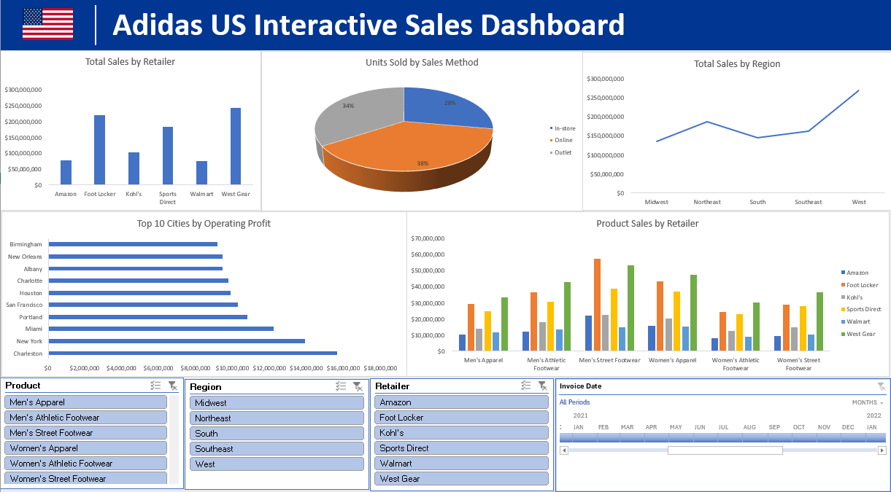

# Charles Agyekum

Data analyst working in Excel, Power BI, SQL and Python. Before analytics I ran
bonded cocoa procurement across three crop seasons, making weekly decisions under
personal bond. That is where the habit comes from: ask what the concentration risk
is, check the number against the source, then say what to do about it.

Every piece below follows the same discipline. Clean first and prove it. Verify
each headline figure before calling it done. End on a recommendation a manager can
act on, not a description of the chart.

---

## Selected work

### [Superstore — Order Fulfilment and Profitability (Power BI)](projects/superstore-fulfilment.html)

A full Power BI build over 51,290 order lines: Power Query ETL, a star-schema
model, seven DAX measures, and a findings panel. Sales were healthy at
£12.6M but margin was thin at 11.6%. The leak traced to one sub-category,
Tables, losing £64,083 at a 29% average discount. Recommendation: cap the
discounting there, leave fulfilment alone.

### [Vrinda Store — 2022 Sales Dashboard (Excel)](projects/vrinda-store.html)

31,047 orders cleaned from raw data, including a quantity column that spelled
"One" and "Two" as text and a hidden trailing space breaking a slicer. A
UNIQUE-based audit caught seven data-quality issues before any chart was built.
Women drove 64% of revenue, concentrated in two categories and two states, with
sales declining across the year. I flagged that concentration as the risk worth
watching.

### [HR Employee Attrition — Dynamic Dashboard (Excel)](projects/hr-attrition.html)

A fully dynamic Excel dashboard over the IBM HR dataset. Coded fields decoded
through lookup tables and a data dictionary, an eight-check QA routine, and the
1/0 flag turned into an attrition rate with AVERAGE. The headline rate verified
at 16.12%, after catching a leftover slicer that had inflated it to 24.66%.

### [Adidas US — Interactive Sales Dashboard (Excel)](projects/adidas-us-sales.html)

9,648 rows of Adidas US sales turned into a one-click interactive dashboard:
three slicers and a date timeline driving every chart at once. Three of six
retailers drive roughly 72% of the ~$900M revenue, which framed where any
partnership decision should focus.

### [SQL Practice — Joins, Subqueries and CASE](projects/sql-practice.html)
A worked set of 31 SQL questions covering joins, subqueries and CASE logic,
with a reference cheat sheet. The grounding behind the measures in the Power BI
work.

### DataCo Smart Supply Chain — Late Delivery (Power BI) *(in progress)*
The differentiated centrepiece, built on data most candidates do not use. Late
delivery rate, on-time-in-full and profit-at-risk over roughly 180,000 rows.
Going live this weekend.

---

*All datasets above are public learning datasets unless stated. Figures are
verified against source. Built as part of a structured analytics programme,
2026.*
