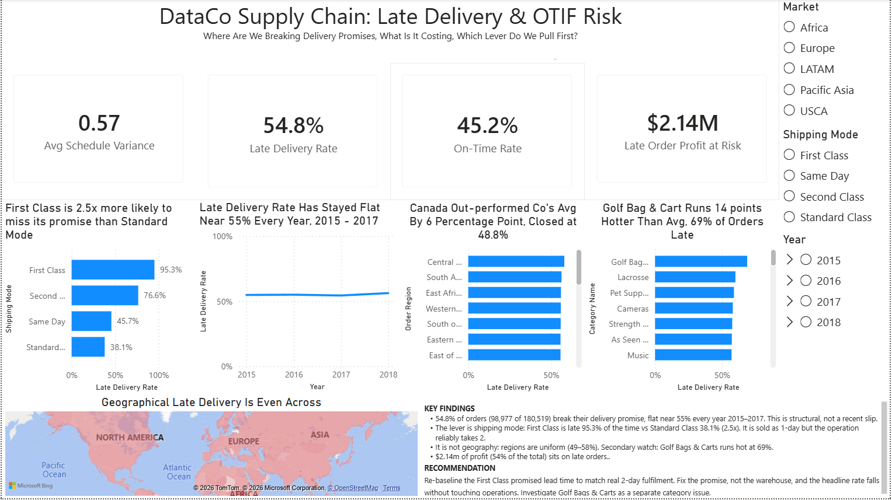

# Late Delivery and OTIF Risk (Power BI)

**Tool:** Power BI Desktop · **Dataset:** DataCo Smart Supply Chain, 180,519
order lines, 65,752 orders, January 2015 to January 2018 · **Built:** June 2026

[← Back to home](../)

## The question

The Head of Supply Chain wants one decision answered: where are we breaking
delivery promises, what is it costing us, and which lever, shipping mode, region
or product category, do we pull first? Every visual on the page earns its place
by moving that decision.

## What I built

1. **Get Data.** Text/CSV import with File Origin set to 1252, because the file
   is Latin-1 and UTF-8 mangles a few text fields. Type detection turned off so
   types were set on purpose, not guessed from the first 200 rows.
2. **Power Query (ETL).** The two date columns failed a plain conversion: the
   dates are US format (M/D/YYYY) against a UK locale, so the whole column went
   to error. Fixed with Change Type using Locale, Date/Time, English (United
   States). Set the shipping-day and flag columns to whole number, sales and
   profit to decimal, and added a calculated column
   `Schedule Variance = [Days for shipping (real)] - [Days for shipment (scheduled)]`.
3. **DAX.** Four measures: Late Delivery Rate (`AVERAGE` of the 1/0 flag),
   On-Time Rate (`1 -` the late rate), Avg Schedule Variance, and Late Order
   Profit at Risk (`CALCULATE` of profit filtered to late orders).
4. **Verified the flag before trusting it.** A Delivery Status by Late Delivery
   Rate table proved the 1/0 flag is a perfect mirror of the text status, Late
   at 100% and everything else at 0%, before any analysis was built on it.
5. **Visuals.** Four KPI cards, late rate by shipping mode, a late-rate trend on
   a zero-based axis, late rate by region, late rate by category, a country map,
   and slicers for Market, Shipping Mode and Year.
6. **Narrative.** Interpret-not-describe titles on every chart plus a Key
   Findings and Recommendation panel.

## Verified headline numbers

| KPI | Value |
|---|---|
| Late Delivery Rate | 54.83% (98,977 of 180,519 order lines) |
| On-Time Rate (OTIF proxy) | 45.17% |
| Avg Schedule Variance | 0.57 days |
| Profit on late orders | $2.14 million, about 54% of total profit |
| First Class late rate | 95.3% |
| Standard Class late rate | 38.1% |

## Findings and recommendation

More than half of all orders break their delivery promise, 54.8%, and it has
held flat near 55% every full year from 2015 to 2017. This is structural, not a
recent slip. The promise breaks often but by a hair: the average schedule slip
is only 0.57 days.

The lever is shipping mode. First Class is 2.5 times more likely to be late than
Standard, 95.3% against 38.1%. The driver is not the warehouse: real fulfilment
time barely varies by mode, around two days. What varies is the promise. First
Class is sold as a one-day service but the operation reliably takes two, so it
is late by design. This is a promise-setting failure, not an operations failure.

Region is the control that proves it. Late delivery is uniform across regions,
49% to 58%, and the country map is near-even. The problem follows the promise,
not the place. One secondary lever is worth a look: Golf Bags and Carts run 14
points above average at 69%.

Recommendation: re-baseline the First Class promised lead time to match the real
two-day fulfilment. Fixing the promise collapses the headline rate without
touching the warehouse, and de-risks the $2.14 million in profit tied to late
orders. Investigate Golf Bags and Carts as a separate category issue.

## Why this is the centrepiece

Most analytics portfolios run on the same handful of datasets. This one is built
on data most candidates do not touch, framed around a single operational
decision, with sector KPIs a supply-chain stakeholder actually tracks: late
rate, on-time-in-full and profit at risk. The titles and the recommendation are
my own reasoning, written on the canvas.

## Skills

1252 encoding and locale-aware date parsing in M · calculated column ·
four DAX measures (`AVERAGE`, `CALCULATE`) · flag-versus-status verification
before building · KPI, sorted bar, line, choropleth and slicer visuals ·
axis honesty, catching a sum-versus-rate error and a misleading zoomed axis on
the trend · reconciliation, checking every sliced view back to the 54.8% anchor ·
source-verified every figure.
